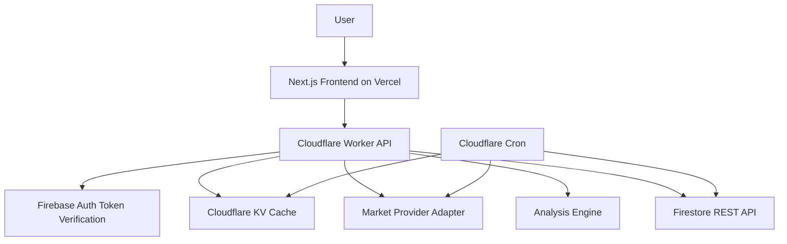
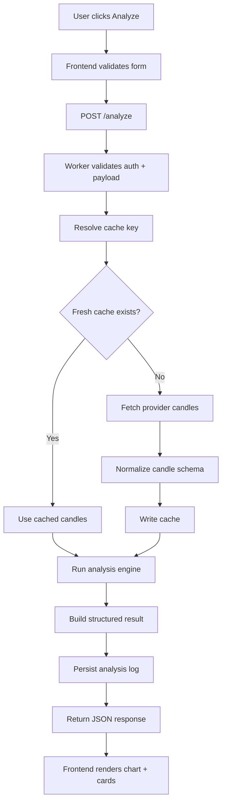
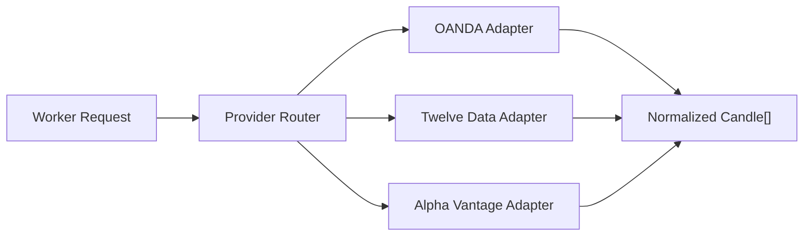
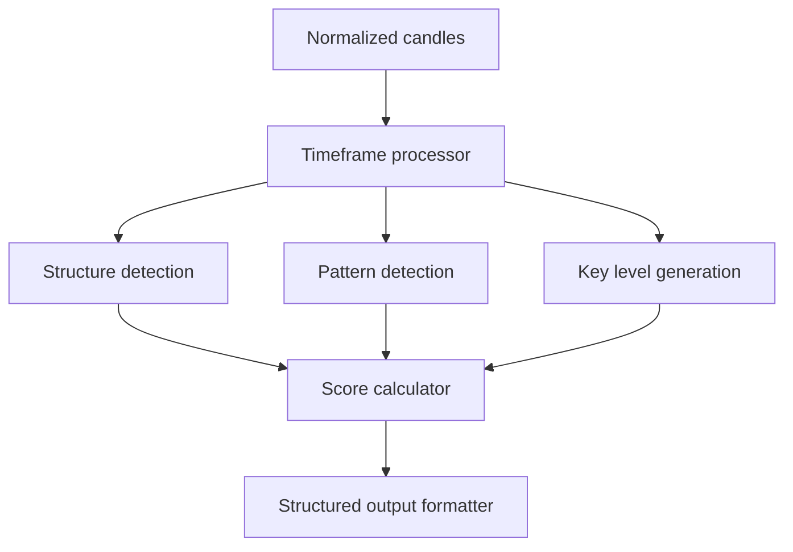
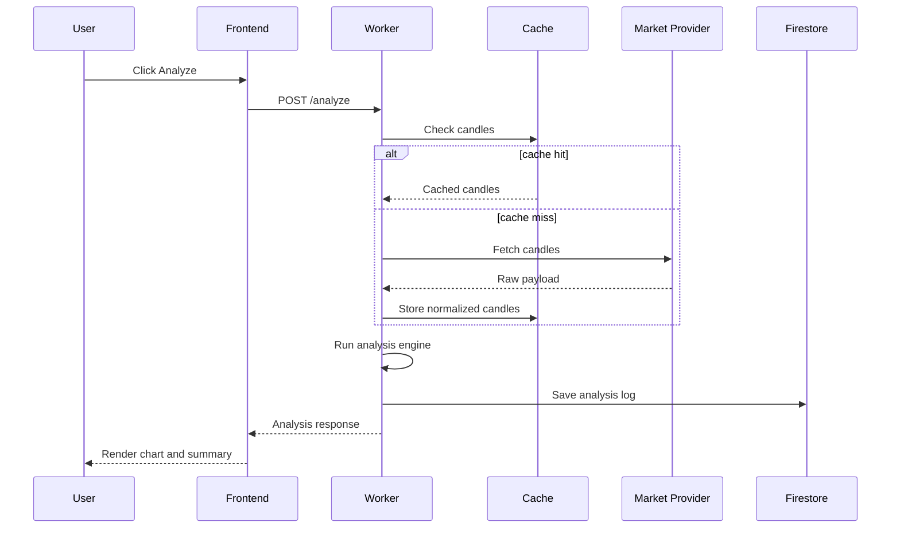
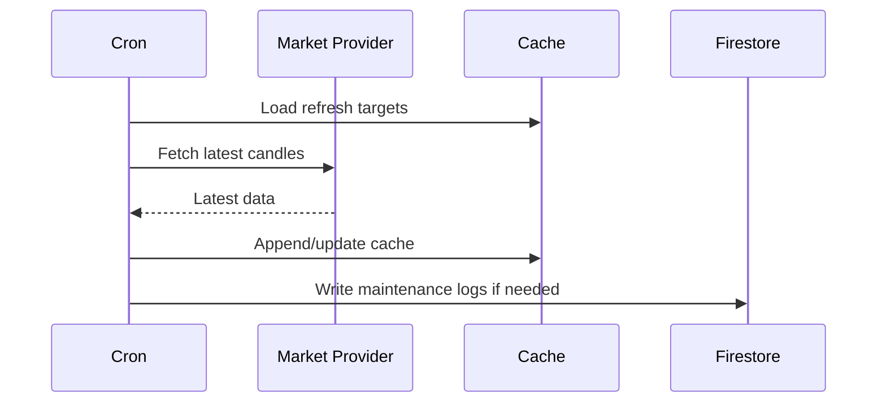

# AI Market Analysis Platform

## Purpose
This document turns the current product idea into an implementation-ready technical blueprint for a cloud-native market analysis platform optimized for:

- low latency
- low infrastructure cost
- modular backend services
- event-driven processing
- clean frontend/backend separation
- gradual scaling from the current single-market app

## Current Repo Reality
The current repository is not yet on the target architecture described in the checklist.

Today it contains:

- a static frontend served locally from [index.html](C:\Users\DELL\Documents\Codex\2026-04-22-an-ai-agent-that-sacn-treading\index.html)
- browser-side logic in [app.js](C:\Users\DELL\Documents\Codex\2026-04-22-an-ai-agent-that-sacn-treading\app.js)
- local Node API emulation in [server.js](C:\Users\DELL\Documents\Codex\2026-04-22-an-ai-agent-that-sacn-treading\server.js)
- Vercel-style API handlers in [api](C:\Users\DELL\Documents\Codex\2026-04-22-an-ai-agent-that-sacn-treading\api)
- Firebase dependencies in [package.json](C:\Users\DELL\Documents\Codex\2026-04-22-an-ai-agent-that-sacn-treading\package.json)

That means the next architecture step is a migration, not a greenfield build.

## Recommended Target Stack

### Frontend
- Vercel-hosted Next.js app
- React + TypeScript
- Tailwind CSS
- shadcn/ui
- TradingView Lightweight Charts

### Backend
- Cloudflare Workers for public API
- Cloudflare Cron Triggers for scheduled cache refresh and cleanup
- Cloudflare KV for hot metadata cache
- Cloudflare R2 or Firebase for larger historical snapshots if needed

### Data and Auth
- Firebase Authentication for user identity
- Firestore for user-scoped analysis history, settings, and saved sessions
- Firestore REST API from Workers instead of `firebase-admin`

### Market Data
- Primary: OANDA or Twelve Data
- Secondary fallback: Alpha Vantage
- Provider adapter abstraction from day one

## Important Architecture Constraint
Cloudflare Workers cannot be treated like a normal Node server.

Design implications:

- do not rely on `firebase-admin` inside Workers
- do not rely on filesystem access or long-running in-memory state
- prefer `fetch`-based integrations
- keep analysis stateless per request
- push durable state into Firestore, KV, R2, or Durable Objects only when required

## System Architecture



## Request Lifecycle



## Primary Modules

### 1. Frontend App
Responsibilities:

- authentication flow
- market/timeframe input selection
- chart rendering
- result rendering
- saved analysis history
- optimistic loading/error states

Checklist:

- [ ] Next.js App Router
- [ ] TypeScript
- [ ] server/client boundary defined
- [ ] mobile-first dashboard layout
- [ ] theme tokens and dark mode
- [ ] lazy-loaded chart module
- [ ] query caching layer
- [ ] structured API client
- [ ] error boundary per page
- [ ] skeleton loading states

### 2. API Worker
Responsibilities:

- validate requests
- verify Firebase identity token
- fetch cached or fresh market data
- run analysis engine
- persist analysis output
- expose operational health endpoints

Checklist:

- [ ] `POST /analyze`
- [ ] `GET /market-data`
- [ ] `GET /history`
- [ ] `GET /status`
- [ ] `GET /sessions`
- [ ] request schema validation
- [ ] auth middleware
- [ ] provider adapter layer
- [ ] cache abstraction
- [ ] JSON response envelope
- [ ] trace id / request id
- [ ] structured error mapping

### 3. Analysis Engine
Responsibilities:

- candle normalization
- multi-timeframe alignment
- structure and pattern detection
- key level generation
- confidence scoring
- human-readable structured output

Checklist:

- [ ] pure functions only
- [ ] provider-agnostic candle input
- [ ] deterministic output for same input
- [ ] test fixtures for each timeframe
- [ ] confidence score rubric
- [ ] output formatter
- [ ] edge-case handling for missing candles
- [ ] partial-result support when some timeframes fail

### 4. Scheduler Layer
Responsibilities:

- refresh hot market pairs
- append new candles only
- expire stale cache entries
- run lightweight maintenance jobs

Checklist:

- [ ] 1m hot pair refresh
- [ ] 5m broader refresh
- [ ] hourly cleanup
- [ ] duplicate update protection
- [ ] provider rate-limit backoff
- [ ] failure alert logging

## Proposed API Contracts

### `POST /analyze`
Request:

```json
{
  "symbol": "XAUUSD",
  "timeframe": "15m",
  "includeHigherTimeframes": true,
  "analysisMode": "standard"
}
```

Response:

```json
{
  "requestId": "req_123",
  "symbol": "XAUUSD",
  "timeframe": "15m",
  "generatedAt": "2026-05-17T12:00:00.000Z",
  "marketData": {
    "source": "twelve-data",
    "cached": true,
    "candlesUsed": 180
  },
  "analysis": {
    "summary": "Bullish continuation bias with pullback risk into demand.",
    "marketState": "bullish",
    "confidenceScore": 0.78,
    "keyLevels": [
      { "type": "support", "price": 3211.2 },
      { "type": "resistance", "price": 3224.8 }
    ],
    "zones": [
      { "type": "demand", "low": 3208.5, "high": 3212.0 }
    ],
    "timeframeContext": {
      "m15": "bullish",
      "h1": "bullish",
      "h4": "neutral"
    }
  }
}
```

### `GET /market-data`
Use this for chart hydration only. Keep it separate from analysis so the frontend can re-render without rerunning expensive logic.

### `GET /history`
Return user-scoped paginated history:

- cursor-based pagination
- newest first
- summary fields only

### `GET /status`
Return:

- worker version
- provider health
- cache health
- Firestore connectivity

## Canonical Data Model

### Candle
```ts
type Candle = {
  symbol: string;
  timeframe: "1m" | "5m" | "15m" | "1h" | "4h" | "1d";
  ts: number;
  open: number;
  high: number;
  low: number;
  close: number;
  volume?: number | null;
  provider: string;
};
```

### Analysis Result
```ts
type AnalysisResult = {
  id: string;
  userId: string;
  symbol: string;
  timeframe: string;
  generatedAt: string;
  requestId: string;
  marketState: "bullish" | "bearish" | "neutral";
  confidenceScore: number;
  summary: string;
  keyLevels: Array<{ type: string; price: number }>;
  zones: Array<{ type: string; low: number; high: number }>;
  context: Record<string, string>;
  providerMeta: {
    source: string;
    cached: boolean;
    candleCount: number;
  };
};
```

## Storage Design

### Firestore Collections
- `users`
- `analysis_logs`
- `saved_sessions`
- `notifications`
- `app_settings`

### Suggested Firestore Document Shapes

`analysis_logs/{analysisId}`

```json
{
  "userId": "uid_123",
  "symbol": "XAUUSD",
  "timeframe": "15m",
  "generatedAt": "2026-05-17T12:00:00.000Z",
  "marketState": "bullish",
  "confidenceScore": 0.78,
  "summary": "Bullish continuation bias with pullback risk into demand.",
  "requestId": "req_123",
  "provider": "twelve-data"
}
```

`saved_sessions/{sessionId}`

```json
{
  "userId": "uid_123",
  "symbol": "XAUUSD",
  "timeframe": "15m",
  "chartState": {},
  "analysisId": "analysis_123",
  "updatedAt": "2026-05-17T12:05:00.000Z"
}
```

### Cache Placement

Use the right store for the right data:

- Cloudflare KV: latest candle metadata, small normalized candle windows, provider freshness timestamps
- Firestore: user history, saved analyses, settings
- R2 optional: archival candle snapshots or bulk research exports

Do not use Firestore as the first-choice hot cache for every market data read. That will become expensive quickly.

## Cache Strategy

### Key Design
Use deterministic keys:

- `candles:XAUUSD:1m`
- `candles:XAUUSD:5m`
- `candles:XAUUSD:15m`
- `analysis:XAUUSD:15m:{bucket}`

### TTL Guidance
- 1m candles: 30-45 seconds
- 5m candles: 2-3 minutes
- 15m candles: 5-8 minutes
- 1h candles: 15-20 minutes
- 4h candles: 45-60 minutes
- 1d candles: 4-12 hours

### Rules
- append only when a new candle timestamp appears
- avoid full-history refetch
- normalize once before caching
- cache provider errors briefly to prevent retry storms

## Provider Abstraction



Provider adapter contract:

- `fetchCandles(symbol, timeframe, limit)`
- `fetchLatestCandle(symbol, timeframe)`
- `normalize(raw) => Candle[]`
- `mapError(error) => ProviderError`

This is important because each provider has:

- different symbol naming
- different time granularities
- different rate limits
- different payload formats

## Analysis Engine Design

Recommended package boundaries:

- `core/candles`
- `core/timeframes`
- `core/levels`
- `core/patterns`
- `core/structure`
- `core/scoring`
- `core/output`
- `core/validation`

Execution flow:



Rules:

- keep functions pure and deterministic
- avoid external API calls inside the engine
- accept prepared candle data only
- make every score explainable
- return machine-readable fields first, human summary second

## Event-Driven Flows

### User-triggered flow


### Scheduled refresh flow


## Security Checklist

### Required
- [ ] Firebase Auth token verification in Worker
- [ ] strict request schema validation
- [ ] per-route rate limiting
- [ ] environment variables for all secrets
- [ ] CORS allowlist
- [ ] structured audit logging
- [ ] anti-abuse checks on public endpoints
- [ ] request size limits

### Never Do
- [ ] never expose provider API keys in browser bundles
- [ ] never expose admin credentials in frontend state
- [ ] never trust timeframe or symbol strings without validation
- [ ] never let the frontend choose provider credentials

## Critical Security Gap In This Repo
The current browser app stores provider and model secrets in frontend-accessible code and local storage patterns. That is acceptable for local prototyping only, but it is not deploy-safe.

Before production:

- move all provider keys to Worker secrets
- move AI model calls behind Worker endpoints
- remove hardcoded secrets from [app.js](C:\Users\DELL\Documents\Codex\2026-04-22-an-ai-agent-that-sacn-treading\app.js)
- rotate any keys that were already committed or exposed

## Performance Checklist

- [ ] lazy-load charting library
- [ ] split chart data fetch from analysis fetch
- [ ] use incremental candle updates
- [ ] compress JSON responses
- [ ] cap analysis payload size
- [ ] persist only summary fields in hot history lists
- [ ] avoid full Firestore document reads for dashboard lists
- [ ] debounce repeated analyze clicks
- [ ] return partial results if one higher timeframe fails

## Reliability Checklist

- [ ] provider timeout budget per request
- [ ] fallback provider path
- [ ] stale-cache fallback when live fetch fails
- [ ] idempotent cron updates
- [ ] dead-letter logging for repeated failures
- [ ] metrics for cache hit rate, provider latency, analysis latency

## Frontend UX Checklist

- [ ] dashboard loads meaningful shell in under 2 seconds on normal connections
- [ ] chart and result panel render independently
- [ ] loading state is visible within 100 ms
- [ ] clear empty states
- [ ] saved analysis accessible from dashboard
- [ ] error toasts are actionable
- [ ] mobile layout supports scan + result reading without horizontal scroll

## Observability
Track these metrics from day one:

- request count
- request latency p50/p95
- cache hit ratio
- provider latency per adapter
- analysis runtime
- analyze success/failure ratio
- cron success/failure ratio
- Firestore write/read volume

## Deployment Topology

### Vercel
- frontend only
- environment variables for public frontend config only
- preview deployments for UI validation

### Cloudflare
- Worker handles `/analyze`, `/market-data`, `/history`, `/status`, `/sessions`
- Cron Triggers for scheduled refresh/cleanup
- KV for hot candle cache

### Firebase
- Auth for identity
- Firestore for user-bound documents

## Migration Plan From This Repo

### Phase 1: Stabilize current code
- [ ] extract analysis logic from [app.js](C:\Users\DELL\Documents\Codex\2026-04-22-an-ai-agent-that-sacn-treading\app.js) into reusable modules
- [ ] define normalized candle types
- [ ] remove secrets from browser code
- [ ] add typed response contracts

### Phase 2: Separate frontend and backend
- [ ] replace local [server.js](C:\Users\DELL\Documents\Codex\2026-04-22-an-ai-agent-that-sacn-treading\server.js) with a real frontend app boundary
- [ ] move `/api/*` logic into Worker-friendly handlers
- [ ] create market provider adapters
- [ ] create cache abstraction

### Phase 3: Add production data flow
- [ ] add Firebase Auth
- [ ] add Firestore persistence via REST
- [ ] add KV cache for candles
- [ ] add Cron refresh jobs

### Phase 4: Harden and scale
- [ ] rate limiting
- [ ] provider fallback
- [ ] metrics dashboards
- [ ] alerting
- [ ] pagination and archive strategy

## Recommended Repo Shape

```text
apps/
  web/                 # Next.js frontend
workers/
  api/                 # Cloudflare Worker API
packages/
  analysis-engine/     # pure analysis logic
  market-providers/    # OANDA / Twelve / Alpha adapters
  shared-types/        # request/response/types
  firebase-client/     # REST helpers, token verification helpers
docs/
  ai-market-analysis-platform-blueprint.md
```

## Deep Build Checklist

### Foundation
- [ ] choose TypeScript across frontend and backend
- [ ] define shared types package
- [ ] define symbol/timeframe validation tables
- [ ] define environment variable contract
- [ ] decide cache store responsibilities

### Backend
- [ ] implement request validation middleware
- [ ] implement auth verification middleware
- [ ] implement provider router
- [ ] implement normalized candle cache service
- [ ] implement analysis service
- [ ] implement Firestore persistence service
- [ ] implement structured error envelope

### Frontend
- [ ] implement authenticated dashboard shell
- [ ] implement market selector and timeframe selector
- [ ] implement chart hydration flow
- [ ] implement analysis result cards
- [ ] implement history page with pagination
- [ ] implement saved session restore

### Data
- [ ] define cache freshness rules per timeframe
- [ ] define provider fallback order
- [ ] define symbol mapping per provider
- [ ] define historical retention policy

### Security
- [ ] rotate exposed secrets
- [ ] add secret scanning to CI
- [ ] add CORS policy
- [ ] add rate limiting
- [ ] add Firestore rules review

### Testing
- [ ] unit tests for normalization
- [ ] unit tests for analysis scoring
- [ ] contract tests for provider adapters
- [ ] Worker integration tests
- [ ] frontend API mock tests
- [ ] smoke test for analyze end-to-end flow

## Final Recommendation
If the goal is speed plus low cost, the strongest architecture for this platform is:

- Vercel for frontend delivery
- Cloudflare Workers for stateless APIs
- Cloudflare KV for market-data hot cache
- Firebase Auth + Firestore only for user and history data
- pure shared analysis engine package used by Worker only

That gives you a fast path to production without paying the cost of a heavier always-on backend.
